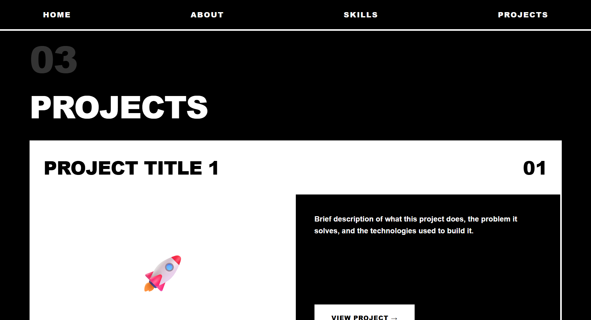

# 🎨 Modern Portfolio Templates Collection

A curated collection of 7 stunning, production-ready portfolio templates designed for developers, designers, and tech professionals. Each template is a single HTML file with embedded CSS and JavaScript - no dependencies, no build tools, just pure HTML magic.

> **💡 Important Note:** These are starter templates! All colors, fonts, spacing, and styles are **fully customizable**. The designs shown are examples - feel free to adjust everything to match your personal brand and preferences.

## ✨ Features

- 🚀 **Zero Dependencies** - Single HTML file per template
- 📱 **Fully Responsive** - Works perfectly on all devices
- 🎭 **Unique Designs** - 7 distinct visual styles
- ⚡ **Performance Optimized** - Fast loading times
- 🎨 **Modern Animations** - Smooth transitions and effects
- 🔧 **Easy Customization** - Simply edit text and content
- 🌐 **GitHub Pages Ready** - Deploy in minutes
- 🎨 **100% Customizable Colors** - Make it match YOUR brand
- 🔤 **Flexible Typography** - Use any fonts you like
- 📐 **Adjustable Layouts** - Modify spacing and structure as needed

## 📦 Templates Overview

### 1. 🎯 Modern Template
**File:** `Modern_template.html`  
**Style:** Contemporary, sleek, professional  
**Best For:** General use, all professionals  
**Colors:** Dark theme with vibrant accents (turquoise, purple)  
**Key Features:**
- Animated background elements
- Smooth section transitions
- Project cards with tags
- Section labels and badges
- Modern glassmorphic buttons

<div align="center">
  
  
  
  
</div>

---

### 2. 🪟 Glassmorphism Template
**File:** `Glassmorphism.html`  
**Style:** Minimalist, elegant, glass-effect UI  
**Best For:** Designers, UX/UI professionals  
**Colors:** Blue and purple gradients  
**Key Features:**
- Frosted glass effect cards
- Soft shadows and blur effects
- Clean, spacious layout
- Morphing background shapes
- Subtle animations

<div align="center">
  
  
  
  
</div>

---

### 3. 🔲 Brutalist Template
**File:** `Brutalist.html`  
**Style:** Bold, high-contrast, typography-focused  
**Best For:** Creative developers, artists, designers  
**Colors:** Black, white, and bold accents  
**Key Features:**
- Massive bold typography
- Sharp geometric shapes
- Strong borders and contrast
- Hover transform effects
- Numbered sections

<div align="center">
  
  
  
  
</div>

---

### 4. 🌈 Gradient Mesh Template
**File:** `Gradient_Mesh.html`  
**Style:** Colorful, 3D-feel, vibrant  
**Best For:** Creative professionals, marketers  
**Colors:** Multi-color gradients (purple, pink, orange)  
**Key Features:**
- Animated gradient background
- Soft shadows and depth
- Glassmorphic cards
- Warm, inviting aesthetic
- Smooth color transitions

<div align="center">
  
  
  
  
</div>

---

### 5. ⚡ Cyberpunk Template
**File:** `Cyberpunk.html`  
**Style:** Futuristic, neon, high-tech  
**Best For:** Game developers, tech enthusiasts  
**Colors:** Neon green, cyan, magenta, yellow  
**Key Features:**
- Glitch text effects
- Neon glowing borders
- Grid background animation
- Scanline effects
- Terminal-inspired design
- RGB color scheme

<div align="center">
  
  
  
  
</div>

---

### 6. 🌿 Nature Template
**File:** `Nature.html`  
**Style:** Warm, earthy, natural  
**Best For:** Freelancers, consultants, eco-friendly brands  
**Colors:** Forest greens, earth tones  
**Key Features:**
- Rounded, flowing shapes
- Soft animations
- Floating leaf elements
- Calm, professional vibe
- Organic color palette

<div align="center">
  
  
  
  
</div>

---

### 7. ☁️ Cloud Template
**File:** `Cloud.html`  
**Style:** Cloud-native, modern tech  
**Best For:** Cloud engineers, DevOps, SRE  
**Colors:** Sky blues and purples  
**Key Features:**
- Floating cloud animations
- Certification badges
- Tech stack tags
- Infrastructure-focused sections
- Clean, professional design

<div align="center">
  
  
  
  
</div>

---

## 🚀 Quick Start

### Option 1: Download and Use
```bash
# Clone the repository
git clone https://github.com/yourusername/portfolio-templates.git

# Navigate to the folder
cd portfolio-templates

# Open any template in your browser
open Modern_template.html
# or
open Glassmorphism.html
# or any other template...
```

### Option 2: GitHub Pages Deployment
1. Fork this repository
2. Choose your favorite template
3. Rename it to `index.html`
4. Delete other template files (optional)
5. Go to repository Settings → Pages
6. Set source to `main` branch
7. Your portfolio is live! 🎉

### Option 3: Direct Download
Download individual templates directly from the repository and open in any browser.

## 🎨 Customization Guide

> **🎨 Remember:** These templates are starting points! Every aspect can be customized - colors, fonts, layouts, animations, and more. Make it your own!

Each template follows the same structure for easy customization:

### 1. Update Personal Information
```html
<!-- Find and replace these sections in your chosen template -->

<!-- Hero Section -->
<h1>Your Name</h1>
<p>Your Professional Title</p>

<!-- About Section -->
<p>Write your introduction here...</p>

<!-- Contact Info -->
<span>your.email@example.com</span>
```

### 2. Update Skills
```html
<!-- Skills are organized in cards/categories -->
<div class="skill-card">
    <h3>Your Skill Category</h3>
    <p>List your technologies here</p>
</div>
```

### 3. Add Your Projects
```html
<!-- Each project card includes -->
<div class="project-card">
    <h3>Project Title</h3>
    <p>Project description...</p>
    <a href="project1.html">View Details</a>
</div>
```

### 4. Customize Colors (Make it YOUR brand!)
Each template has color values throughout the `<style>` section. Search and replace to match your brand:

```css
/* Example: Changing the primary color scheme */

/* BEFORE (Template default) */
background: linear-gradient(135deg, #667eea 0%, #764ba2 100%);
color: #4ecdc4;
border: 2px solid #00ffff;

/* AFTER (Your custom colors) */
background: linear-gradient(135deg, #FF6B6B 0%, #4ECDC4 100%);
color: #FFA502;
border: 2px solid #FF6B6B;
```

**Color Customization Tips:**
- 🎨 Use [Coolors.co](https://coolors.co) to generate color palettes
- 🎨 Use [ColorHunt](https://colorhunt.co) for inspiration
- 🎨 Maintain contrast ratios for accessibility (use [WebAIM Contrast Checker](https://webaim.org/resources/contrastchecker/))
- 🎨 Stick to 2-4 main colors for consistency
- 🎨 Test colors in both light and dark environments

### 5. Customize Fonts
```css
/* Change the font family at the top of the <style> section */

/* Default */
font-family: 'Segoe UI', Tahoma, sans-serif;

/* Your choice */
font-family: 'Inter', 'Roboto', sans-serif;

/* Or import Google Fonts */
@import url('https://fonts.googleapis.com/css2?family=Poppins:wght@300;400;600;700&display=swap');
font-family: 'Poppins', sans-serif;
```

### 6. Adjust Animations & Effects
```css
/* Make animations faster/slower */
transition: all 0.3s;  /* Change to 0.5s or 0.1s */
animation: fadeIn 1s;   /* Change duration */

/* Disable animations if preferred */
animation: none;
transition: none;
```

## 📁 Repository Structure

```
portfolio-templates/
├── README.md
├── Modern_template.html
├── Glassmorphism.html
├── Brutalist.html
├── Gradient_Mesh.html
├── Cyberpunk.html
├── Nature.html
├── Cloud.html
└── images/
    ├── banner.png (optional)
    ├── modern_1.png
    ├── modern_2.png
    ├── modern_3.png
    ├── modern_4.png
    ├── glassmorphism_1.png
    ├── glassmorphism_2.png
    ├── glassmorphism_3.png
    ├── glassmorphism_4.png
    ├── brutalist_1.png
    ├── brutalist_2.png
    ├── brutalist_3.png
    ├── brutalist_4.png
    ├── gradient_mesh_1.png
    ├── gradient_mesh_2.png
    ├── gradient_mesh_3.png
    ├── gradient_mesh_4.png
    ├── cyberpunk_1.png
    ├── cyberpunk_2.png
    ├── cyberpunk_3.png
    ├── cyberpunk_4.png
    ├── nature_1.png
    ├── nature_2.png
    ├── nature_3.png
    ├── nature_4.png
    ├── cloud_1.png
    ├── cloud_2.png
    ├── cloud_3.png
    └── cloud_4.png
```

## 📸 Screenshots Guide

When taking screenshots for your own projects or contributing:

### What to Capture (4 images per template):
1. **Image 1: Hero Section** - Landing/welcome screen with main heading
2. **Image 2: About Section** - About me section with text content
3. **Image 3: Skills Section** - Skills cards or categories display
4. **Image 4: Projects Section** - Project showcase cards

### Technical Specifications:
- **Resolution**: 1920x1080 or higher
- **Format**: PNG for best quality
- **File Size**: Compress to under 500KB per image (use TinyPNG)
- **Naming**: Follow the pattern `templatename_1.png`, `templatename_2.png`, etc.

### How to Take Screenshots:

**Method 1: Browser DevTools (Recommended)**
```bash
1. Open the template in Chrome/Edge
2. Press F12 to open DevTools
3. Click Toggle Device Toolbar (Ctrl+Shift+M)
4. Set resolution to 1920x1080
5. Press Ctrl+Shift+P
6. Type "Capture full size screenshot"
7. Save to /images folder
```

**Method 2: Browser Extensions**
- [GoFullPage](https://chrome.google.com/webstore) - Full page screenshots
- [Awesome Screenshot](https://www.awesomescreenshot.com/)

**Method 3: Online Tools**
- [Screenshot.guru](https://screenshot.guru) - Enter URL, get screenshot
- [Web-Capture.net](https://web-capture.net)

### Tips for Best Results:
- ✅ Capture in light mode AND dark mode if template supports it
- ✅ Show hover effects if possible
- ✅ Ensure all text is readable
- ✅ Remove any personal/test data
- ✅ Center important content in frame

## 📝 Creating Project Detail Pages

Each template links to separate project pages (`project1.html`, `project2.html`, etc.). Create these files with similar styling:

```html
<!DOCTYPE html>
<html lang="en">
<head>
    <meta charset="UTF-8">
    <title>Project Name</title>
    <!-- Copy styles from main template -->
</head>
<body>
    <h1>Project Name</h1>
    <p>Detailed project description...</p>
    <a href="index.html">← Back to Portfolio</a>
</body>
</html>
```

## 🛠️ Tech Stack

All templates are built with:
- **HTML5** - Semantic markup
- **CSS3** - Modern styling, animations, grid/flexbox
- **Vanilla JavaScript** - Smooth scrolling, interactions
- **No frameworks** - Pure, dependency-free code

## 📱 Browser Support

- ✅ Chrome/Edge (latest)
- ✅ Firefox (latest)
- ✅ Safari (latest)
- ✅ Mobile browsers (iOS Safari, Chrome Mobile)

## 🎯 Use Cases

- **Personal Portfolio** - Showcase your work and skills
- **Developer Resume** - Interactive online resume
- **Project Showcase** - Display your projects beautifully
- **Freelancer Site** - Attract potential clients
- **GitHub Profile** - Link from your GitHub profile
- **Job Applications** - Stand out with a unique portfolio

## 💡 Tips for Success

1. **Choose the Right Template**
   - Match the style to your industry
   - Consider your target audience
   - Pick colors that represent your brand
   - **Don't be afraid to mix elements from different templates!**

2. **Content is King**
   - Write clear, concise descriptions
   - Highlight your best projects (3-5 max)
   - Include measurable achievements
   - Use action verbs

3. **Make it YOUR Own**
   - 🎨 **Change the colors** to match your personal brand
   - 🔤 **Experiment with fonts** - try Google Fonts
   - 📐 **Adjust spacing** - more/less padding and margins
   - ✨ **Modify animations** - make them faster, slower, or remove them
   - 🖼️ **Add your own images** instead of emoji placeholders
   - **Remember:** The templates are just a starting point!

4. **Optimize for SEO**
   - Add descriptive `<title>` tags
   - Include meta descriptions
   - Use semantic HTML
   - Add alt text to images

5. **Keep it Updated**
   - Add new projects regularly
   - Update skills as you learn
   - Refresh content every few months
   - Remove outdated information

6. **Test Everywhere**
   - Check on mobile devices
   - Test in different browsers
   - Ask friends for feedback
   - Use Chrome DevTools for responsiveness

## 🎨 Choosing Your Template

**Note:** Colors shown are examples only - customize to your taste!

| Template | Best For | Complexity | Vibe | Customization Difficulty |
|----------|----------|------------|------|-------------------------|
| Modern | Everyone | Medium | Professional | Easy ⭐⭐ |
| Glassmorphism | Designers | Low | Elegant | Easy ⭐⭐ |
| Brutalist | Creatives | High | Bold | Medium ⭐⭐⭐ |
| Gradient Mesh | Marketers | Low | Vibrant | Easy ⭐⭐ |
| Cyberpunk | Tech Enthusiasts | High | Futuristic | Medium ⭐⭐⭐ |
| Nature | Freelancers | Low | Calm | Easy ⭐⭐ |
| Cloud | DevOps/Cloud | Medium | Technical | Easy ⭐⭐ |

> 💡 **Pro Tip:** Start with a template that matches your vibe, then customize colors and fonts to make it uniquely yours!

## 🤝 Contributing

Found a bug? Have a suggestion? Want to add a new template?

1. Fork the repository
2. Create a feature branch (`git checkout -b feature/new-template`)
3. Commit your changes (`git commit -am 'Add new template'`)
4. Push to the branch (`git push origin feature/new-template`)
5. Open a Pull Request

### Contribution Guidelines
- Maintain single-file HTML structure
- Ensure responsive design
- Test on multiple browsers
- Add screenshots to `/images` folder
- Update README with template details

## 📄 License

This project is licensed under the MIT License - feel free to use these templates for personal or commercial projects.

```
MIT License - Free to use, modify, and distribute
```

## 🙏 Acknowledgments

- Inspired by modern web design trends
- Built for the developer community
- Designed with accessibility in mind
- Special thanks to all contributors

## ⭐ Show Your Support

If you found these templates helpful:
- ⭐ Star this repository
- 🔄 Fork and customize
- 🐦 Share on social media
- 📝 Write a blog post about your experience
- 💬 Leave feedback in discussions

---

## 👤 Author

**Lir Chen**
- GitHub: [@LirChen](https://github.com/LirChen)
- LinkedIn: [Lir Chen](https://linkedin.com/in/lir-chen)
- Portfolio: [lirchen.github.io](https://lirchen.github.io/)

<div align="center">
Made with ❤️ by developers, for developers
⬆ Back to Top
</div>

Happy coding! 🚀